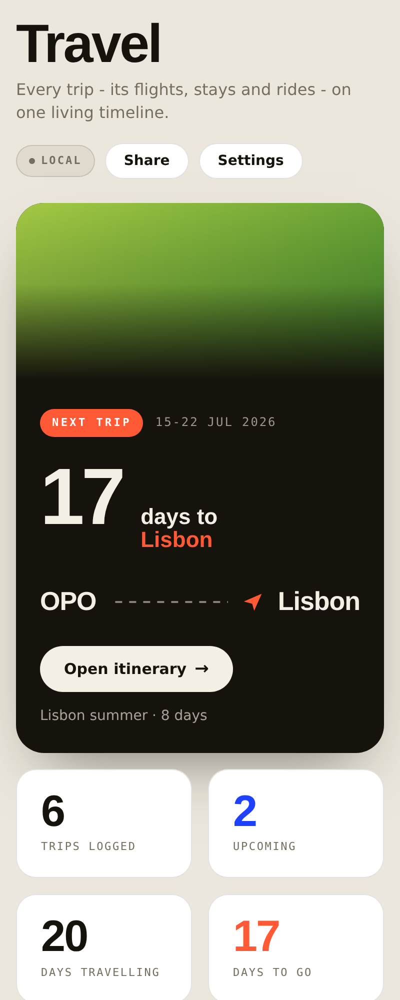
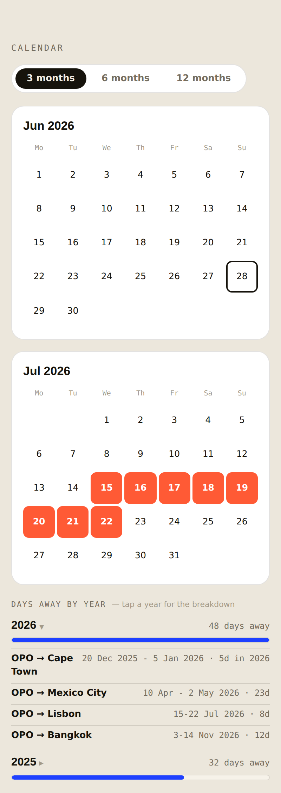
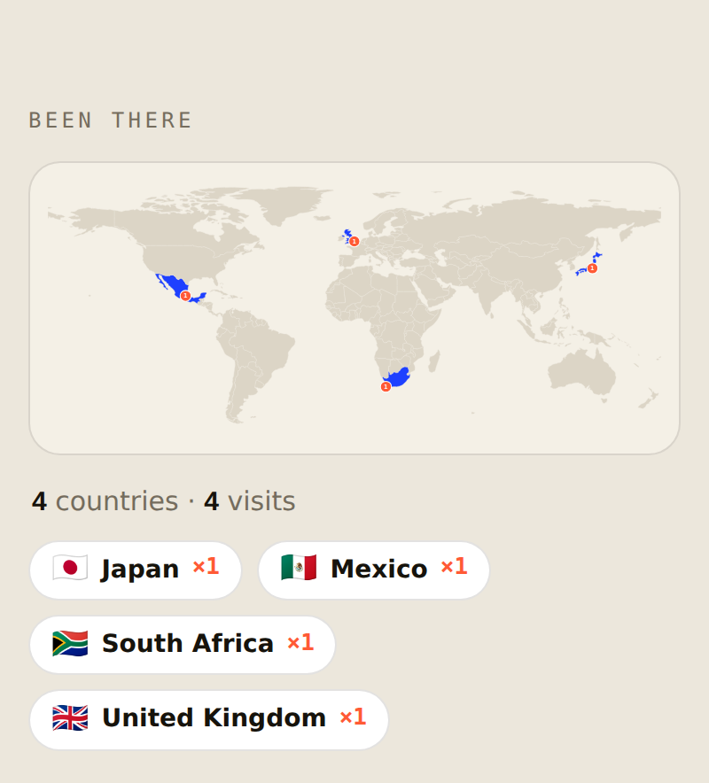

# ✈️ Travel — your own personal travel hub

A single-screen travel app you **host yourself**, for free, on your own
Cloudflare account. It syncs your trips two-way with your
[Dynamite Circle](https://dynamitecircle.com) account (using *your* DC Member
API key), then adds the stuff the DC app doesn't: a year calendar, a
"been there" world map, per-trip weather, currency, plug type, emergency
numbers, and one-tap "add to any calendar."

> **Personal, self-hosted, augments DC — it does not replace it.** Each person
> runs their *own* copy with their *own* key and their *own* data. Nobody logs
> into anyone else's instance; there is no shared server. This is the "pull your
> own data into your own dashboard" use the DC Member API is meant for.

## A look inside

| Your next trip | Year overview + days away | "Been there" map |
|:---:|:---:|:---:|
|  |  |  |

<sub>Screenshots use sample trips; photos shown as placeholders.</sub>

## ✨ Key features

**Trips & DC sync**
- 🔄 **Two-way sync with DC** — add or edit a trip in the app and the **dates**
  push to your DC account; trips already in DC (upcoming *and* past) pull back in.
- 🔒 **Dates only, ever** — only trip start/end dates are sent to DC. Your notes,
  hotels, flights and plans never leave your own Worker.
- 🛟 **Safe by design** — the sync never deletes a DC trip, and your in-app edits
  win (no more dates silently reverting).
- 🧳 **Per-trip plans** — attach flights, hotels, rides and free-text notes to any
  trip; manual plans are never overwritten by a sync.

**Planning & overview**
- 🗓️ **Calendar overview** — a 3 / 6 / 12-month view of exactly when you're away,
  with every travel day marked.
- 📊 **Days away by year** — see total days travelled per calendar year (Jan 1–Dec 31);
  tap a year for the per-trip breakdown so any number is one tap from "why."
- 🌍 **"Been there" world map** — every country you've set foot in, filled in on a
  world map, each with a **visit count** (even tiny island nations).
- 🛫 **Upcoming / Past / Wishlist** tabs, with a fare-watch wishlist for trips
  you're still dreaming up.

**At-a-glance destination intel** (auto-filled per trip)
- 🌦️ **Weather** for your travel dates (forecast, or the typical climate if far off).
- 💱 **Currency** vs both **€ and $**, live rates.
- 🔌 **Plug type & voltage** so you pack the right adapter.
- 🆘 **Local emergency number**.
- 🖼️ **A real photo** of where you're heading.

**On your phone & yours alone**
- 📅 **Add to any calendar** — one-tap `.ics` export for Apple / Google / Outlook.
- 📱 **Installs like a native app** — Add to Home Screen on iPhone or Android, opens
  full-screen, works offline (it's a PWA). *(Step-by-step below.)*
- 🔐 **Your own password** — set once, stays signed in for 30 days per device.
- 🗄️ **Backup & import** — export all your trips as JSON, re-import any time.
- 🛡️ **100% your data** — everything lives in *your* Cloudflare account; nobody
  else (not even the repo author) can see your trips or your key.

## Deploy your own (≈5 minutes, free)

### 1. Click the button

[](https://deploy.workers.cloudflare.com/?url=https://github.com/giovannibrees/travelapp)

This copies the repo into **your** GitHub, creates the Worker in **your**
Cloudflare account, and **auto-creates the KV namespace** it needs. (Free plan
is plenty.) When it finishes you'll get a URL like
`https://travelapp.<you>.workers.dev`.

### 2. Open the app and set your password

Open your new URL. The **first** person to log in sets the email + password —
so do this immediately. (Use any email; it's just your login.)

### 3. Paste your DC key — in the app, no dashboard needed

In DC, go to **dc.dynamitecircle.com → your profile menu → DC Member API Key**
and copy it (starts with `dk_`). Then in the app: **Settings → Connect DC →
paste the key → Save → Test connection.** Your trips start syncing both ways.

> Your key is stored only on **your** Worker, used only server-side, and never
> shown back to the browser in full. Hit **Disconnect** any time to remove it.

### 4. Put it on your phone's home screen

See **"📱 Add it to your home screen"** just below for the per-phone steps.

That's it. 🎉

## 📱 Add it to your home screen

The app is a **PWA** — once it's on your home screen it opens full-screen with
its own icon, no browser bars, and works like a normal app (even offline for the
parts that don't need the network).

### iPhone / iPad (Safari)
1. Open your app URL (e.g. `https://travelapp.<you>.workers.dev`) in **Safari**
   — this must be Safari, not Chrome, on iOS.
2. Tap the **Share** button (the square with an arrow pointing up).
3. Scroll down and tap **Add to Home Screen**.
4. Edit the name if you like → tap **Add** (top right).
5. Open it from the new icon. Log in once; it stays signed in for 30 days.

### Android (Chrome)
1. Open your app URL in **Chrome**.
2. Tap the **⋮** menu (top right).
3. Tap **Add to Home screen** (or **Install app** if it's offered).
4. Confirm **Add / Install**.
5. Open it from the new icon and log in.

> **Tip:** add it on every device you use — each one stays signed in on its own,
> and they all sync through your Worker.

<details>
<summary>Prefer the command line? (optional)</summary>

```bash
git clone https://github.com/giovannibrees/travelapp && cd travelapp
npm i -g wrangler && wrangler login
wrangler kv namespace create TRIPS      # paste the id into wrangler.toml
wrangler deploy
# then set your DC key in-app (Settings → Connect DC), or as a secret:
# echo "dk_your_key" | wrangler secret put DC_API_KEY
```
</details>

## Optional extras

All optional — the app is fully functional with just your DC key.

- **Google Calendar two-way sync**, **Gmail→trip parsing (via Claude)**, and
  **Calendly** are supported by the Worker but need their own credentials. Set
  them as Worker secrets if you want them (see `.dev.vars.example`). Without
  them, those features simply stay off.

## How it works

- `travel-app.html` / `public/index.html` — the front end (one file, vanilla JS).
- `worker.js` — the Cloudflare Worker: serves the app, gates it behind your
  password, runs the two-way DC sync (and the optional integrations), and stores
  everything in one KV namespace (`TRIPS`).
- `wrangler.toml` — Worker config: the KV binding and a 30-minute sync cron.

```
Trip: { id, dcId, from, to, start (YYYY-MM-DD), end, label, notes, segments[] }
```

Only trip **dates** are ever pushed to DC. Your notes and plans stay on your
Worker. The sync never deletes a DC trip.

## Privacy

Everything lives in **your** Cloudflare account: your trips in your KV, your DC
key on your Worker, behind your password. The maintainer of this repo has no
access to your instance or your data.

## License

[PolyForm Noncommercial 1.0.0](LICENSE) — free to run, modify, and self-host for
any **noncommercial** purpose. You may not sell it or use it commercially.
